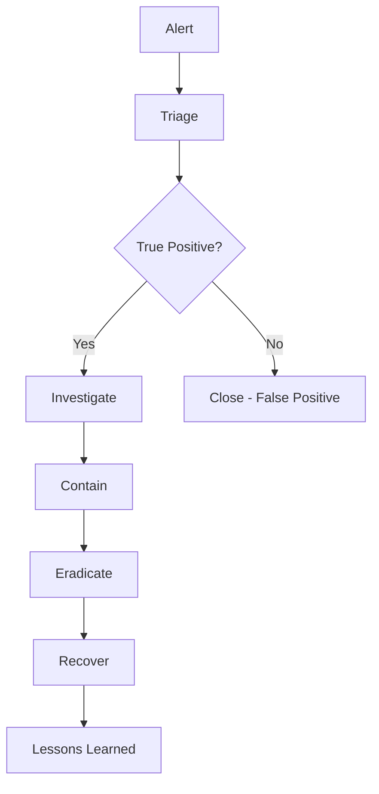

# 🏛️ SIEM & SOC

## Introduction

Un SIEM (Security Information and Event Management) collecte et analyse les logs de sécurité en temps réel. Un SOC (Security Operations Center) est l'équipe qui utilise ces outils pour surveiller et répondre aux incidents.

## 🔍 SIEM - Concepts Fondamentaux

### Fonctionnalités Principales
- **Collecte de logs**
- **Corrélation d'événements**
- **Détection d'anomalies**
- **Alertes en temps réel**
- **Reporting et compliance**

### Architecture Type
```
Sources → Collecteurs → SIEM → Analystes → Réponse
  ↓           ↓          ↓        ↓        ↓
Logs      Parsing   Corrélation SOC   Remediation
```

## 🛠️ Solutions SIEM Populaires

### Enterprise
- **Splunk Enterprise**
- **IBM QRadar**
- **ArcSight (Micro Focus)**
- **LogRhythm**

### Open Source
- **Elastic Stack (ELK)**
- **OSSIM/AlienVault**
- **Wazuh**
- **Graylog**

### Cloud
- **Azure Sentinel**
- **AWS Security Lake**
- **Google Chronicle**
- **Sumo Logic**

## 📊 Configuration Splunk

### Installation et Configuration
```bash
# Installation Splunk
tar -xvf splunk-8.2.0-linux.tgz
./splunk start --accept-license

# Configuration inputs
[monitor:///var/log/apache2/access.log]
index = web_logs
sourcetype = apache_access
```

### Recherches Communes
```spl
# Top des adresses IP
index=firewall | top src_ip

# Détection brute force SSH
index=linux sourcetype=syslog "Failed password"
| stats count by src_ip, user
| where count > 10

# Analyse des codes d'erreur web
index=web_logs status>=400
| timechart span=1h count by status
```

## 🚨 Détection et Alertes

### Types de Règles
1. **Signature-based** (IOCs connus)
2. **Behavioral** (anomalies)
3. **Machine Learning** (patterns)
4. **Threat Intelligence** (feeds externes)

### Exemple de Règle
```yaml
# Sigma rule - Suspicious PowerShell
title: Encoded PowerShell Command
status: experimental
description: Detects suspicious encoded PowerShell commands
logsource:
    product: windows
    service: powershell
detection:
    selection:
        EventID: 4103
        ScriptBlockText|contains: 
            - 'FromBase64String'
            - 'EncodedCommand'
    condition: selection
falsepositives:
    - Legitimate scripts
level: medium
```

## 🏢 SOC - Structure et Organisation

### Modèles SOC
- **In-house SOC**
- **Managed SOC (MSOC)**
- **Hybrid SOC**
- **Virtual SOC**

### Tiers d'Analyste
```
Tier 3 (Expert)
    ↑
Tier 2 (Specialist)
    ↑
Tier 1 (Analyst)
```

#### Responsabilités par Tier
**Tier 1** : Monitoring, triage initial
**Tier 2** : Investigation approfondie, escalade
**Tier 3** : Threat hunting, développement règles

## 📈 Métriques SOC

### KPIs Essentiels
- **MTTD** (Mean Time To Detection)
- **MTTR** (Mean Time To Response)
- **MTTA** (Mean Time To Acknowledgment)
- **Alert Fatigue Rate**
- **False Positive Rate**

### Tableau de Bord Type
| Métrique | Objectif | Actuel |
|----------|----------|--------|
| MTTD | < 1h | 45min |
| MTTR | < 4h | 3.2h |
| FP Rate | < 10% | 8% |

## 🔄 Processus Incident Response

### Phases NIST
1. **Preparation**
2. **Detection & Analysis**
3. **Containment, Eradication & Recovery**
4. **Post-Incident Activity**

### Workflow SOC


## 🎯 Threat Hunting

### Méthodologies
- **IOC-based Hunting**
- **TTP-based Hunting** (MITRE ATT&CK)
- **Behavioral Hunting**
- **Crown Jewel Analysis**

### Outils et Techniques
```bash
# YARA rules
rule APT_Malware {
    strings:
        $s1 = "malicious_string"
        $s2 = { 6A 40 68 00 30 00 00 }
    condition:
        $s1 or $s2
}

# PowerShell hunting
Get-WinEvent -FilterHashtable @{LogName='Security'; ID=4688} |
Where-Object {$_.Message -like "*powershell*"}
```

## 📊 Use Cases Prioritaires

### Top 10 Use Cases
1. **Malware Detection**
2. **Data Exfiltration**
3. **Account Compromise**
4. **Insider Threats**
5. **Web Application Attacks**
6. **Network Intrusions**
7. **Privilege Escalation**
8. **Lateral Movement**
9. **Command & Control**
10. **Compliance Monitoring**

## 🔧 Intégration et Orchestration

### SOAR (Security Orchestration)
- **Phantom (Splunk)**
- **Demisto (Palo Alto)**
- **IBM Resilient**
- **TheHive + Cortex**

### APIs et Automation
```python
# Exemple intégration Splunk
import splunklib.client as client

service = client.connect(
    host="localhost",
    port=8089,
    username="admin",
    password="password"
)

# Recherche automatisée
searchquery = 'search index=security | head 10'
job = service.jobs.create(searchquery)
```

## 📚 Compliance et Frameworks

### Standards Applicables
- **ISO 27035** (Incident Management)
- **NIST CSF** (Cybersecurity Framework)
- **SOX, PCI DSS, HIPAA**
- **GDPR** (Privacy)

### Documentation Requise
- **Playbooks**
- **Runbooks**
- **Procedures**
- **Training Materials**

## 🎓 Compétences et Formation

### Skills Techniques
- **Log Analysis**
- **Network Protocols**
- **Operating Systems**
- **Scripting** (Python, PowerShell)
- **Threat Intelligence**

### Certifications Recommandées
- **GCIH** (SANS Incident Handler)
- **GCFA** (SANS Forensics)
- **GNFA** (SANS Network Forensics)
- **CISSP**

## 💰 ROI et Justification

### Métriques Business
- **Réduction temps d'arrêt**
- **Prévention pertes données**
- **Compliance costs**
- **Insurance premiums**

### Calcul ROI
```
ROI = (Gains - Coûts) / Coûts × 100
```

---

🎯 **Success Factor** : Un SOC efficace combine technologie, processus et personnes qualifiées pour une défense proactive.